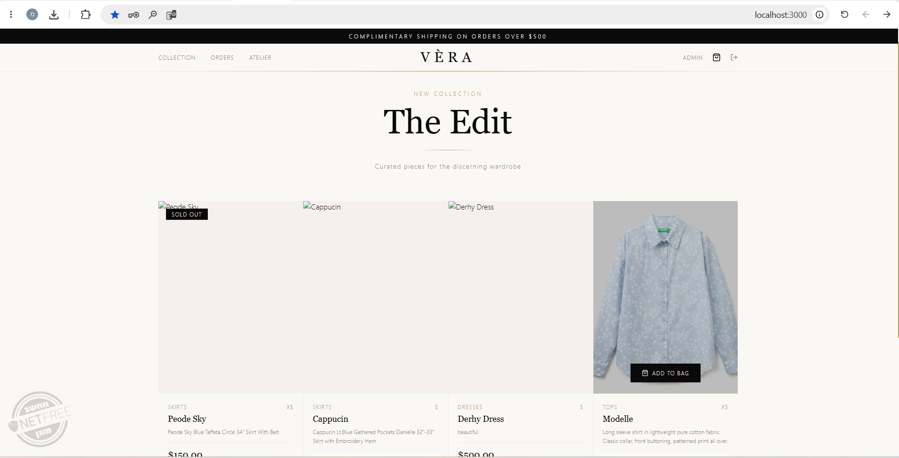
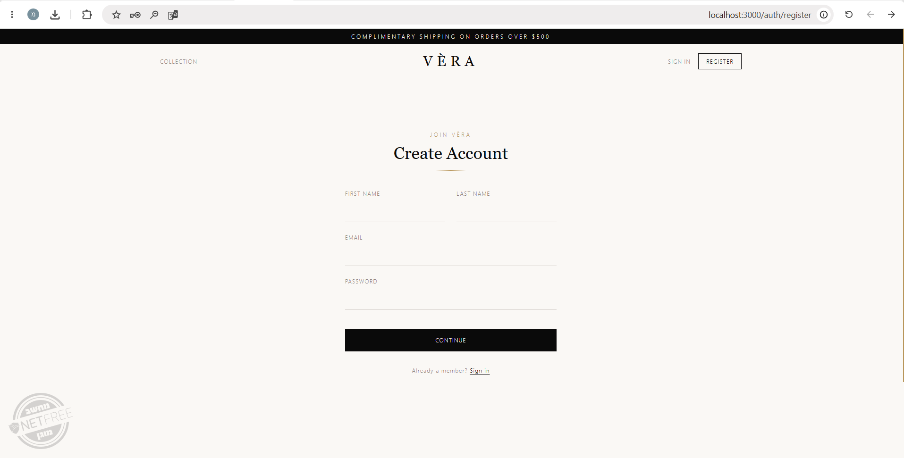
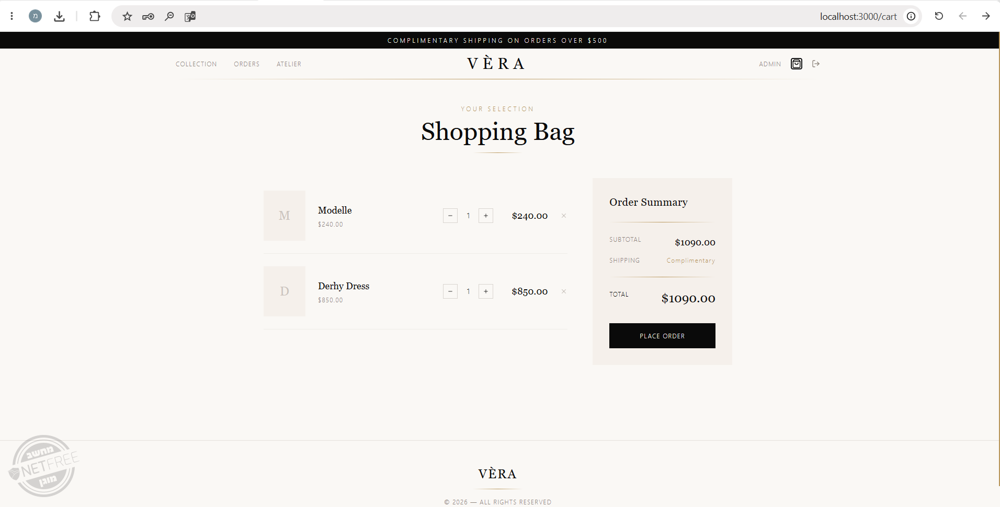
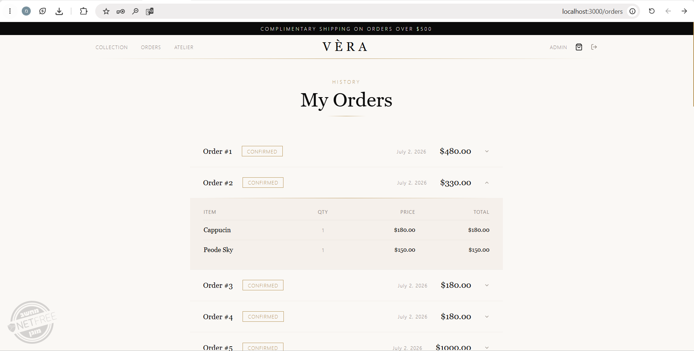
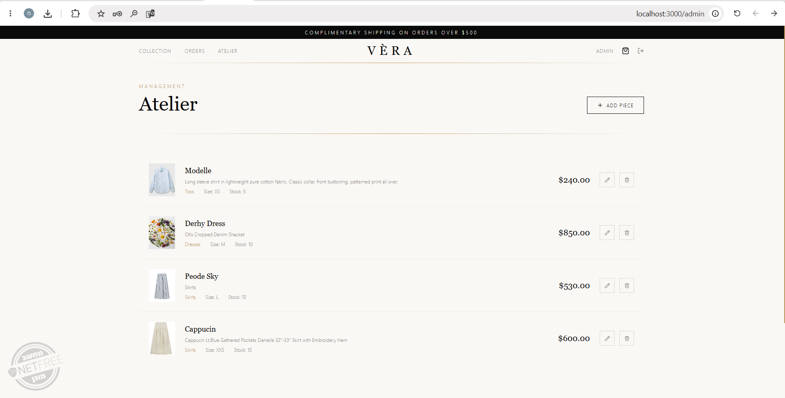
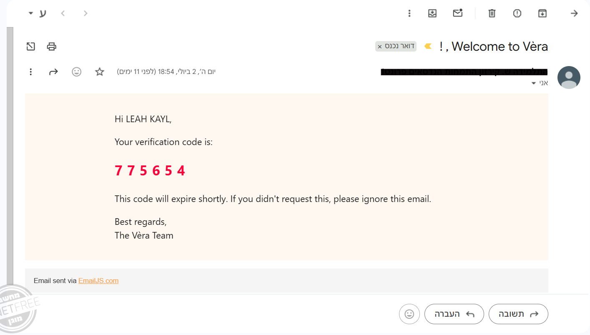

# ECommerce Project - Monolith to Microservices


מערכת ECommerce לימודית לחנות בגדים, הבנויה כבסיס מונוליטי עם מעבר מתוכנן (וחלקי) לארכיטקטורת Microservices.

## Demo


## תצוגות מהמערכת

| מסך | תמונה |
|---|---|
| דף בית |  |
| התחברות והרשמה |  |
| עגלת קניות |  |
| הזמנות (Admin) |  |
| יצירת מוצר חדש (Admin) |  |
| ממשק Admin |  |
| Swagger |  |
| אימייל אימות |  |
| אימייל אישור/קבלה |  |
| אימייל ביטול |  |

## מה כולל הפרויקט

- מערכת אימות משתמשים עם JWT והרשאות Customer/Admin
- קטלוג מוצרים עם CRUD מלא למנהלים
- סל קניות אישי לכל משתמש
- יצירת הזמנות מהסל ועדכון מלאי
- Health Check ל-API
- תשתית Docker Compose להרצה מהירה

## שפות וטכנולוגיות

### שפות

- C#
- TypeScript
- JavaScript
- SQL
- HTML
- CSS

### טכנולוגיות וספריות

- .NET 8 Web API
- Entity Framework Core
- PostgreSQL
- Next.js 14 (App Router)
- React
- Tailwind CSS
- JWT Authentication
- BCrypt
- Docker + Docker Compose

## מבנה רלוונטי של הפרויקט

```text
microservices/
├── backend/
│   └── src/
│       ├── ECommerce.API/
│       ├── ECommerce.Application/
│       ├── ECommerce.Domain/
│       └── ECommerce.Infrastructure/
├── frontend/
├── Images/
└── microservices-new/
```

## התחלה מהירה

### דרישות מוקדמות

- Docker
- Docker Compose
- Git

### הרצה עם Docker

```bash
git clone <repository-url>
cd microservices
docker compose up --build
```

### כתובות גישה

- Frontend: http://localhost:3000
- API + Swagger: http://localhost:5000/swagger
- Health Check: http://localhost:5000/api/health

## הרצה מקומית ללא Docker

### Backend

```bash
cd backend/src/ECommerce.API
dotnet restore
dotnet run
```

### Frontend

```bash
cd frontend
npm install
npm run dev
```

## API עיקרי

| Method | Endpoint | Description |
|---|---|---|
| POST | /api/auth/register | Register |
| POST | /api/auth/login | Login |
| POST | /api/auth/admin-register | Admin Register |
| GET | /api/products | Get Products |
| POST | /api/orders/from-cart | Order from Cart |
| GET | /api/cart | Get Cart |
| GET | /api/health | Health Check |

## ארכיטקטורה

המערכת בנויה בגישת Clean Architecture בשכבות:

1. Domain
2. Application
3. Infrastructure
4. API

מבנה זה מקל על מעבר מדורג ל-Microservices לפי תחומים: משתמשים, מוצרים, סל, הזמנות ומלאי.

## רישיון

פרויקט לימודי.
